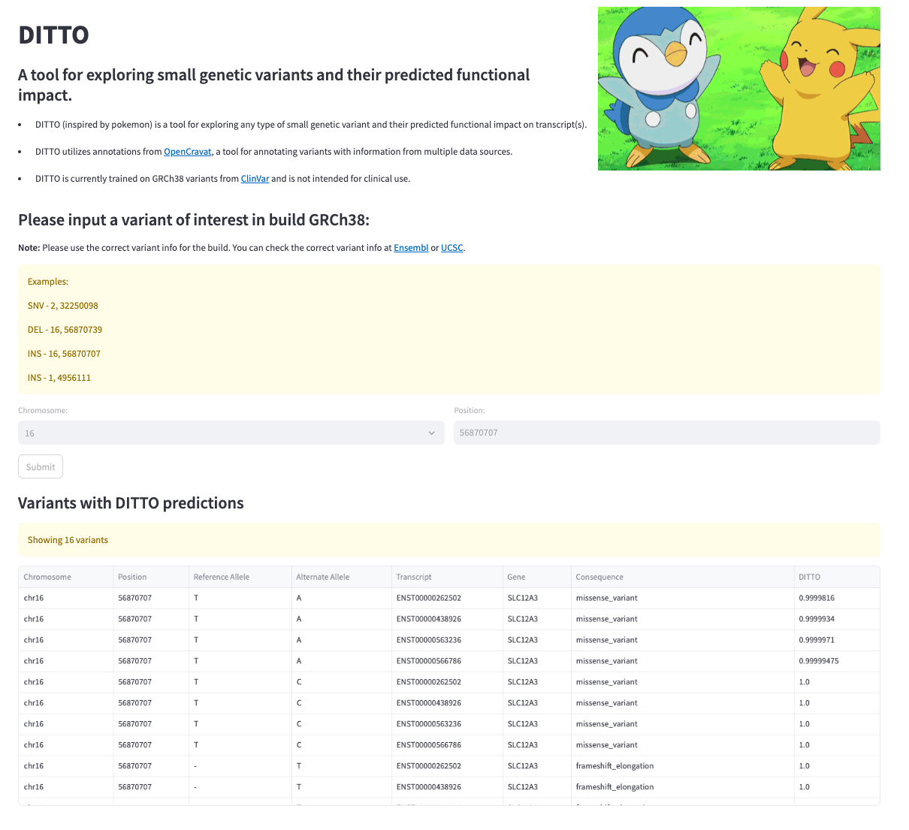

# DITTO-UI

Easy to use web interface for biologists to look for any type of small genetic variant and understand their deleteriousness
using DITTO scores.

_!!! For research purposes only !!!_

## Description

A web app where one can lookup small variants and understand the deleteriousness using DITTO deleterious score and Clinvar
reported significance. DITTO uses an explainable neural network model to predict the functional impact of variants. It is trained on variants from ClinVar and uses OpenCravat for
annotations from various data sources. The higher the score, the more likely the variant is deleterious.

## Data

DITTO-UI renders precomputed DITTO scores for variants extracted from [DITTOdb](https://s3.lts.rc.uab.edu/cgds-public/dittodb/dittodb.html).

## Usage

DITTO-UI is deployed on the Streamlit Cloud: [DITTO-UI site](https://cgds-ditto.streamlit.app). Here's an example on how it looks
like



### Installation

Installation simply requires fetching the source code. Following are required:

- Git

To fetch source code, change in to directory of your choice and run:

```sh
    git clone https://github.com/uab-cgds-worthey/DITTO-UI.git
```

### Requirements

*OS:*

This app is developed and tested in Mac OS.

*Environment:*

- [Anaconda](https://docs.anaconda.com/anaconda/install/)

```sh
# create environment. Needed only the first time. Please use the above link to install anaconda!.
conda env create -f environment.yml

conda activate ditto-ui
```

### Run DITTO-UI locally

To run DITTO-UI locally make sure the environment has been succesfully made and then run the following commands

```sh
# run the DITTO-UI application using Streamlit
streamlit run src/app.py
```

Once the application has started up it will open a new tab in your default browser to DITTO-UI

## Contact Info

Tarun Mamidi | <tmamidi@uab.edu>
